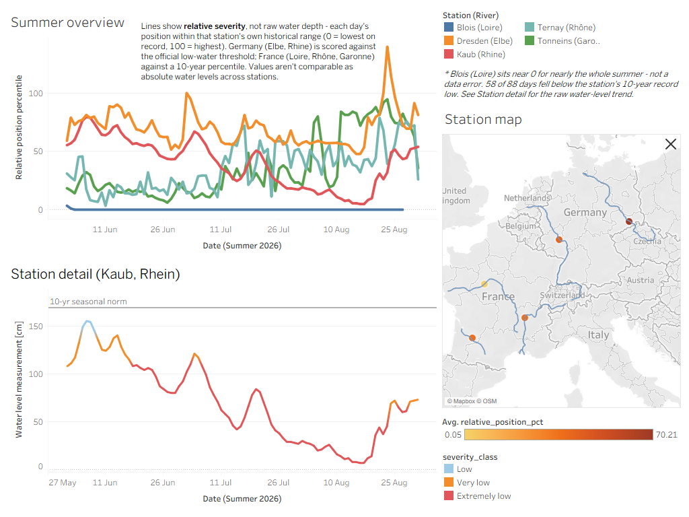
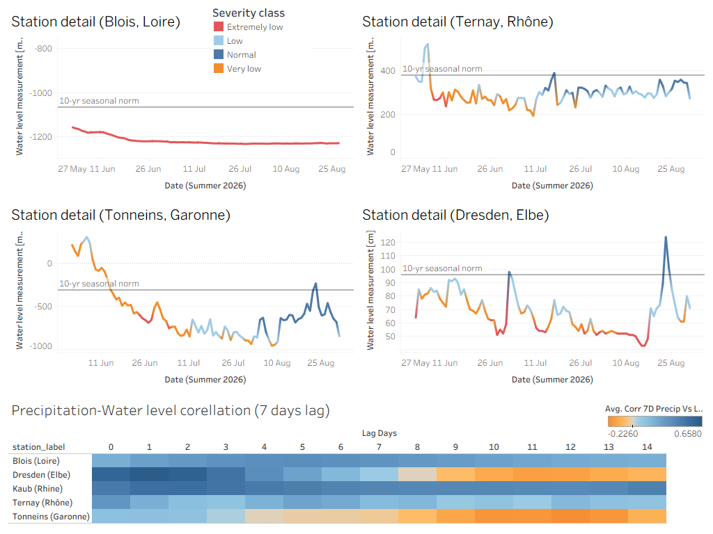
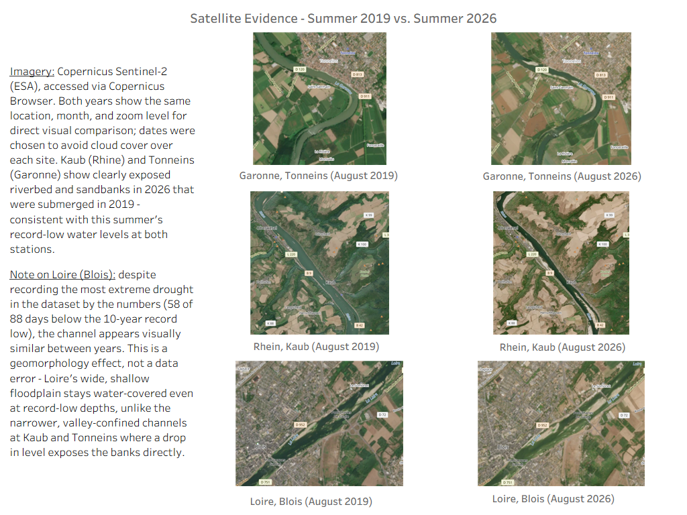

# European River Water-Level Anomalies, Summer 2026

A presentation-first Tableau project showing a daily-granularity snapshot of the Summer 2026 drought across five monitoring stations and four major European river basins. The Tableau workbook is included as `river_summer_2026.twbx`; the CSV pipeline remains available for reproducibility and Tableau Public import.

### Station Map and Overview



**Author:** Pavel Krasavin  
**Portfolio:** [github.com/savlino](https://github.com/savlino)  
**LinkedIn:** [linkedin.com/in/pavel-krasavin](https://www.linkedin.com/in/pavel-krasavin)

## TL;DR

This project is a presentation-first analysis of Summer 2026 river water-level anomalies across five stations on the Rhine, Elbe, Garonne, Loire, and Rhône. It combines manual NIWIS and Hydro-Eaufrance CSV exports, 10-summer French historical baselines, live API validation, Open-Meteo weather enrichment, Python/pandas processing, and Tableau dashboards.

The main conclusion is that Summer 2026 was exceptionally dry at several stations: Kaub on the Rhine reached a new low of 7 cm, while Blois on the Loire was below its 10-summer historical minimum on 58 of 88 available days. The Loire result is consistent with independent reporting describing an exceptionally early and severe drought, but its negative local gauge values and apparent measurement floor require cautious interpretation. Weather correlations are exploratory rather than causal because rainfall must be aggregated across upstream watersheds and routed through the river system. Economic impacts are discussed only as external context; this project reports measured anomalies and does not estimate economic losses.

## Published Tableau Package

- [Tableau workbook](river_summer_2026.twbx)
- [Published Tableau Public workbook](https://public.tableau.com/app/profile/pavel.krasavin1517/viz/european_river_discharge_summer_2026/Overall)

### Station Details and Precipitation Correlations



### Visual Evidence



The visual evidence dashboard combines the quantitative station views with manually sourced Copernicus/Sentinel-2 comparisons. The original image pairs remain available as source material:

- [Garonne, 2019-08-22](assets/copernicus_shots/Garrone_2019-08-22_crop.png) vs. [2026-08-19](assets/copernicus_shots/Garrone_2026-08-19_crop.png)
- [Kaub, 2019-08-23](assets/copernicus_shots/Kaub_2019-08-23_crop.png) vs. [2026-08-13](assets/copernicus_shots/Kaub_2026-08-13_crop.png)
- [Loire, 2019-08-22](assets/copernicus_shots/Loire_2019-08-22_crop.png) vs. [2026-08-12](assets/copernicus_shots/Loire_2026-08-12_crop.png)

These satellite images are illustrative evidence only. They are not part of the CSV pipeline and should not be interpreted as calibrated water-level measurements.

The dashboard PNGs remain in the repository as stable previews for readers who cannot open the Tableau workbook or access Tableau Public. The interactive Tableau Public link above is the primary presentation; the screenshots provide a fixed visual reference for the published state of the work.

## Key Findings

- **Kaub / Rhine:** the summer minimum was 7 cm, below the previous 25 cm record, with 14 days below that historical minimum and 68 days classified `Extrem niedrig` under NIWIS thresholds.
- **Dresden / Elbe:** the summer minimum was 43 cm, below the configured 46 cm historical minimum, with 2 days below the record and a less severe profile than Kaub.
- **Tonneins / Garonne:** the average historical-relative position was 36.2%; 6 days were `Extrem niedrig` and 39 were `Sehr niedrig`.
- **Ternay / Rhône:** the average historical-relative position was 35.9%; 4 days were `Extrem niedrig` and 28 were `Sehr niedrig`.
- **Blois / Loire:** this is the most extreme French result. The 2026 series falls below the 10-summer historical minimum on 58 of 88 available days, with 88 days in the `Extrem niedrig` band and an average relative position of 0.1%.

### Loire Interpretation and Caveat

The Blois signal should be presented as **extremely affected by drought**, not as a routine percentile fluctuation. Independent reporting published by AFP on 26 July 2026 described the Loire as exceptionally and unusually early dry, placed the river at `alerte` level with initial water-use restrictions, and reported natural flows comparable to historically dry 2003 and 2019 conditions. See the [Le Petit Journal / AFP reference](https://lepetitjournal.com/expat-mag/environnement/la-loire-en-alerte-eprouvee-par-une-secheresse-exceptionnelle-449934).

At the same time, Blois values are reported relative to a local gauge datum and are therefore negative and not directly comparable with Ternay, Tonneins, Kaub, or Dresden. The 0.1% relative position means the 2026 observations sit at or below the available historical distribution for the same seasonal window; it does not mean the river has 0.1% of a common physical water-level norm. The unusually persistent low Blois graph should also be treated as a station-specific warning signal because historic minima cluster near an apparent measurement or control-structure floor. It supports the drought narrative, but absolute cross-station claims should be avoided.

## Data Sources & Attribution

- Water level data (Germany): NIWIS/PEGELONLINE operator, Datenlizenz Deutschland – Namensnennung 2.0
- Water level data (France): Hub'Eau / Hydro-Eaufrance (Système d'Information sur l'Eau), Etalab Open Licence 2.0
- Weather data: [Open-Meteo.com](https://open-meteo.com/), CC BY 4.0
- Satellite imagery: Copernicus Sentinel-2 data, via Copernicus Browser (ESA)
- River geometry: Natural Earth, public domain
- Basemap: © Mapbox © OpenStreetMap contributors

---

## 1. Project Structure

```text
river_discharge_2026/
├── river_summer_2026.twbx        # Packaged Tableau workbook
├── assets/                       # Tableau dashboard exports and visual evidence
│   ├── dashboard_station_map.png
│   ├── dashboard_correlation.png
│   ├── dashboard_visual_evidence.png
│   └── copernicus_shots/         # Manual Sentinel-2 comparison exports
├── data/
│   └── raw/
│       ├── niwis/                # Manual CSV exports from NIWIS (Rhine & Elbe)
│       │   ├── Kaub (Rhein).csv
│       │   └── Dresden (Elbe).csv
│       ├── pegelonline/          # Archived PEGELONLINE API snapshots (validation only)
│       │   ├── kaub_pegelonline_p31d.csv
│       │   └── dresden_pegelonline_p31d.csv
│       ├── hydro_eaufrance/      # Manual Hauteur (H) exports (France, primary source)
│       │   ├── O900001002_H.csv
│       │   ├── K447001001_H.csv
│       │   ├── V303002002_H.csv
│       │   └── Historic/         # Merged 10-summer (2016-2025) reference baselines
│       │       ├── O900001002_H_10y_summer_hist.csv
│       │       ├── K447001001_H_10y_summer_hist.csv
│       │       └── V303002002_H_10y_summer_hist.csv
│       └── hubeau/               # Archived Hub'Eau recent-observation snapshots (validation only)
│           ├── O900001002_H_api_snapshot.csv
│           ├── K447001001_H_api_snapshot.csv
│           └── V303002002_H_api_snapshot.csv
├── output/
│   ├── european_drought_summer_2026_tidy.csv  # Primary Tidy dataset for Tableau Public
│   ├── meteo_river_correlation.csv            # Lagged weather cross-correlation matrix
│   ├── summary_metrics_2026.csv               # Station-level drought impact summary
│   ├── pegelonline_validation.csv             # NIWIS vs. PEGELONLINE cross-check
│   └── hydro_eaufrance_validation.csv         # Manual export vs. Hub'Eau cross-check
├── scripts/
│   ├── config.py                 # Station coordinates & metadata
│   ├── ingest_niwis.py           # Parser for German NIWIS exports with official thresholds
│   ├── ingest_pegelonline.py     # PEGELONLINE REST API v2 -- validation only (Germany)
│   ├── ingest_hydro_eaufrance.py # Parser for French Hauteur (H) manual exports
│   ├── ingest_hubeau.py          # Hub'Eau recent-observations API -- validation only (France)
│   ├── ingest_meteo.py           # Open-Meteo API enrichment & lagged correlation analysis
│   └── build_pipeline.py         # Master pipeline builder
├── requirements.txt
└── README.md
```

---

## 2. Confirmed Data Sources & Integration Strategy

| Region / Scope | Primary Data Source | Metric & Unit | Validation Source | Role in Analysis |
| :--- | :--- | :--- | :--- | :--- |
| **Germany** (Rhine & Elbe) | **NIWIS** (*niwis-online.de*), manual CSV exports | Water Level (`W`, cm) | PEGELONLINE REST API v2 (rolling ~31-day window) | **Primary Hero Dataset**: Official 1991-2020 reference period with pre-computed calendar-day-specific low-water thresholds. |
| **France** (Garonne, Loire, Rhône) | **Hydro-Eaufrance** (*hydro.eaufrance.fr*), manual "Hauteur" (H) CSV exports | Water Level (`H`, mm) | Hub'Eau recent-observations API (official endpoint: `observations_tr`, rolling ~1-month window) | **Cross-Basin Comparison**: Sub-daily height readings aggregated to daily means and benchmarked against a 10-summer (2016-2025) station-specific reference distribution. |
| **Atmospheric Enrichment** | **Open-Meteo** (*open-meteo.com*) | Mean temperature (°C), precipitation (mm) | Historical Archive REST API | **Enrichment**: Daily precipitation and temperature series for lagged correlation with water level. |
| **Visual Evidence** | **Copernicus Browser / Sentinel-2** | Cloud-free optical satellite imagery | Manual PNG export to `assets/` | **Qualitative Presentation**: Visual before/after riverbed comparisons for reports and dashboard cards. |

Both countries now follow the same manual-export-as-truth + live-API-as-validation pattern: the tidy dataset is always built from the manually exported CSVs, while the corresponding live REST API is only used to archive an independent snapshot and cross-check it -- it never overrides the tidy values.

### Cross-Validation Results

The independent API checks broadly support the manual exports, but their coverage is limited. PEGELONLINE was added late in the project and exposes only a rolling recent window, so the preserved comparison covers the late-August window available in the archived snapshot. In the current report, the maximum absolute difference is **3.2 cm at Kaub** and **3.4 cm at Dresden** between the NIWIS daily value and the PEGELONLINE daily mean. This is a late-window validation check, not a full-summer API replication.

The validation CSVs also include `relative_diff_pct`, calculated as `diff / abs(manual_value) * 100`. This expresses the API-minus-manual discrepancy relative to the manual observation while remaining meaningful for French stations whose gauge values can be negative. In the current archived reports, the largest PEGELONLINE relative differences are **8.89% at Kaub** and **3.82% at Dresden**. The current Hub'Eau report shows **0.0% for Tonneins** and **0.13% for Blois** where overlap was available. Relative percentages should still be read alongside the absolute difference: near-zero gauge readings can make a small absolute discrepancy look large in relative terms.

Hub'Eau recent-observations validation covers only the late-August dates available in both the live window and the manual French exports. These comparisons validate agreement in the overlapping period; the manual exports remain the authoritative source for the summer dataset and historical baselines.

---

## 3. Data Source Exclusions & Technical Trade-offs

During data-source architectural review, several potential data sources were evaluated and deliberately excluded from automated ETL ingestion:

1. **PEGELONLINE REST API (`pegelonline.wsv.de`) / Hub'Eau recent-observations API**
   - *Technical Limitation:* Both are open, no-auth REST APIs, but each enforces a rolling window on raw time-series data -- PEGELONLINE exposes roughly the most recent month, while Hub'Eau's official `observations_tr` endpoint rejects any `date_debut_obs` older than ~1 calendar month. Because PEGELONLINE validation was implemented late, the archived comparison covers only August 19-31 rather than the full August window.
   - *Architectural Decision:* Neither can supply a full-summer or multi-year baseline. Manual CSV exports (NIWIS for Germany, Hydro-Eaufrance for France) serve as the authoritative source for the tidy dataset; both live APIs are used exclusively to archive an independent snapshot and cross-validate the manual values (see `output/pegelonline_validation.csv` and `output/hydro_eaufrance_validation.csv`).

2. **Danube / Hungary (vizugy.hu / hydroinfo.hu / DanubeHIS)**
   - *Technical Limitation:* No open programmatic historical REST API is available. Web portals provide HTML-rendered tables without structured open endpoints.
   - *Architectural Decision:* Excluded from the tabular data pipeline. Documented qualitatively instead: the Danube gauge at Budapest broke its all-time record low repeatedly over the summer — from the prior record of 33 cm (set in 2018) to 31 cm in late July, roughly 23 cm in early August, and ultimately just 1 cm by September 8, following Hungary's driest summer since 1901 (Hungarian General Directorate of Water Management, via Xinhua/Telex reporting).

3. **Po River / Italy (ARPA Regional Portals)**
   - *Technical Limitation:* Hydrological monitoring is fragmented across regional agencies (ARPA Lombardia, ARPA Piemonte, ARPAE Emilia-Romagna) without a single standardized national REST API.
   - *Architectural Decision:* Excluded from the programmatic pipeline; referenced qualitatively instead: at Cremona, the Po's gauge fell to 8.59 m below its hydrometric zero on July 31, 2026 — surpassing the previous record of 8.58 m set during the 2022 drought. The Po River Basin Authority (Adbpo) raised its water-stress alert to "high," with over 100 municipalities in Piedmont and Lombardy facing drinking-water supply issues (ANSA).

4. **GRDC (Global Runoff Data Centre) & EFAS (European Flood Awareness System)**
   - *Technical Limitation:* GRDC requires formal application and data usage agreements; EFAS real-time discharge requires restricted Copernicus credentials.
   - *Architectural Decision:* Excluded in favor of open, reproducible public sources.

---

## 4. Methodology & Metrics Computation

### 1. Tidy Schema Structure (Tableau Public Ready)
Every row in `output/european_drought_summer_2026_tidy.csv` represents a single daily station observation:
- `river`: River name (`Rhine`, `Elbe`, `Garonne`, `Loire`, `Rhône`)
- `station_id`: Unique station identifier
- `station_name`: Official monitoring station name (`Kaub`, `Dresden`, `Tonneins`, `Blois`, `Ternay`)
- `country`: `Germany` or `France`
- `latitude` / `longitude`: Decimal coordinates for spatial mapping
- `date`: Daily timestamp (`YYYY-MM-DD`, June 1 – August 31, 2026)
- `metric`: `Water Level` for all stations (unified across both countries)
- `unit`: `cm` (Germany, NIWIS convention) or `mm` (France, Hydro-Eaufrance convention) -- kept in each source's native unit; not converted, since the tidy schema is self-describing per row
- `value`: Daily mean measured value. French "Hauteur" values are relative to a local, station-specific gauge datum and can be negative (e.g. Blois) -- only meaningful as a day-over-day trend within the same station, not comparable in absolute terms across stations
- `reference_period`: `1991-2020` official period for NIWIS stations; `2016-2025 summer reference (10 summers, Hydro-Eaufrance)` for French stations
- `seasonal_norm`: For Germany, the calendar-day-specific "niedrig" (low) threshold from the NIWIS export. For France, the median of the 2016-2025 reference distribution for the same point in the season
- `relative_position_pct`: For Germany, `value / seasonal_norm * 100`, where `seasonal_norm` is the day-specific NIWIS threshold. For France, the value's **percentile rank (0-100) against the 2016-2025 historical distribution** for the same point in the season. This field is deliberately **not** named `pct_of_seasonal_norm`: French gauge readings sit on arbitrary local datums and are frequently negative, which makes a percentage-of-norm ratio mathematically meaningless for those stations. A percentile rank is datum-independent and comparable across stations
- `severity_class`: For Germany, NIWIS's official calendar-day-specific bands (`Normal` / `Niedrig` / `Sehr niedrig` / `Extrem niedrig`). For France, percentile bands against the 10-summer reference: `<= 10` = `Extrem niedrig`, `<= 25` = `Sehr niedrig`, `<= 50` = `Niedrig`, else `Normal`
- `historical_min_record`: Known pre-2026 record low. For Germany, the official record (e.g. 25 cm for Kaub). For France, the lowest daily mean observed across the 10 reference summers
- `is_below_historical_min`: `True` if the day's value fell below `historical_min_record`
- `data_source`: Provenance of the river measurement (`NIWIS_manual_export` or `HydroEaufrance_manual_export`) -- the tidy dataset never contains fabricated/synthetic rows
- `meteo_data_source`: Provenance of the weather enrichment (`OpenMeteo_API`, or `Synthetic_fallback` only if explicitly opted into via `ALLOW_SYNTHETIC_FALLBACK` in `build_pipeline.py`)
- `temp_mean_c`: Daily mean temperature (°C) from Open-Meteo
- `precip_sum_mm`: Daily precipitation sum (mm) from Open-Meteo

**Known data gap:** the Blois (Loire) manual export only covers June 1 – August 27, 2026 (88 of 92 days) -- the source export did not include the final days of August. This shows up as a shorter series for Blois in Tableau; it is a genuine gap in the provided source data, not a pipeline defect.

**In summary:** the project combines five river monitoring stations across four major European river basins. German observations use NIWIS daily water levels and official reference thresholds. French observations use Hydro-Eaufrance daily means derived from sub-daily height measurements, benchmarked against a 10-summer (2016-2025) reference distribution assembled from the same source. Because French stations use local gauge datums and publish no official reference-period classification, cross-station comparisons rely on within-station percentile ranks (`relative_position_pct`) rather than absolute water levels.

#### French reference baseline construction
For each French station, the ten merged summers in `data/raw/hydro_eaufrance/Historic/` are aggregated to daily means. For a given calendar day, the reference sample pools all historical daily means falling within **±7 calendar days across all 10 summers** (~150 observations), which keeps percentiles stable -- a single calendar day on its own would only offer 10 values. Each 2026 daily value is then scored as its percentile rank within that pooled sample. Because the reference follows the seasonal curve, this correctly distinguishes "low for early June" from "low for late August" instead of comparing against a single flat summer average.

### 2. Lagged Weather-Hydrology Cross-Correlation
The module `scripts/ingest_meteo.py` computes Pearson cross-correlations between river water level and meteorological drivers across lags 0 to 14 days. Results are exported to `output/meteo_river_correlation.csv` with columns `corr_temp_vs_level` and `corr_7d_precip_vs_level` (both metrics are water levels, not discharge).

The calculation is:

`correlation at lag tau = corr(river_value at t + tau, weather at t)`

`lag_days` means **weather leads, river lags**: the river value observed that many days later is correlated against the weather recorded on the earlier day. In plain terms: a `lag_days = 5` row means precipitation accumulated during the preceding 7-day window is compared with the river level observed **five days later**. This directionality matters for the interpretation -- it tests whether weather *predicts* a future change in river level, not the reverse.

#### Why this is an exploratory signal, not a causal rainfall model

We should not expect a strong direct correlation between precipitation measured at a station coordinate and the water level at that same station. River levels integrate rainfall across an upstream watershed: precipitation may fall far from the gauge, travel through tributaries, arrive after a basin-specific routing delay, or be moderated by soil, groundwater, reservoirs, abstractions, and channel conditions. The [USGS overview of watersheds and drainage basins](https://www.usgs.gov/water-science-school/science/watersheds-and-drainage-basins) provides the relevant hydrological context.

The current analysis uses local Open-Meteo weather series and a simple 0-14 day lag window. It does **not** calculate basin-wide precipitation totals, upstream-weighted rainfall, travel-time distributions, antecedent soil moisture, evaporation, reservoir operations, or causal effects. The correlation dashboard should therefore be read as an honest exploratory diagnostic: it shows whether the selected local weather series and later station levels move together at any tested lag, not whether local rainfall directly caused the observed river-level change. A stronger research design would require station-specific upstream catchment boundaries, gridded rainfall aggregation, and hydrological routing.

Temperature correlations are retained as a mechanically generated output column for completeness, but no separate temperature-correlation investigation or interpretation is included in this project. That analysis was deliberately left out to prevent the scope from expanding unpredictably beyond the focused water-level and precipitation question.

### 3. Research Scope and Economic Context

This is a compact portfolio analysis, not a full-scale hydrological or economic research study. Its purpose is to present a sober, reproducible set of water-level numbers, historical-relative positions, validation checks, and visual evidence for Summer 2026. It does not estimate lost output, transport costs, agricultural losses, employment effects, household impacts, or the causal contribution of drought to any individual economic outcome.

The wider economic stakes are included as context rather than as project outputs:

- The [CMCC analysis of droughts and Europe's economy](https://www.cmcc.it/article/droughts-europes-economy-is-paying-the-price-e439-billion-already-lost-while-the-damage-almost-doubles-with-2c) reports that the 2015-2018 European drought has already been associated with an estimated €439 billion in losses, with impacts accumulating over subsequent years; it also models substantially larger losses in a warmer climate. These are multi-year, continent-scale research estimates and must not be presented as estimates produced by this project.
- The excluded Danube case appears to have been hit harder than any of the rivers covered here, although it cannot be ranked directly against them because it is outside the structured dataset. [IntelliNews reported record-low water levels halting Danube shipping](https://www.intellinews.com/record-low-water-levels-halt-danube-shipping-457678/), with reduced barge loads, higher transport costs, and disruption to tourism and freight. Broader reporting also describes cargo shipping being largely halted in Austria, Austrian hydropower generation falling by roughly 30%, and industrial shippers such as Voestalpine shifting freight to rail. Budapest's gauge broke its all-time low repeatedly through the summer, as documented in Section 3. If a future iteration adds Danube coverage, it would likely be the most severe case in the dataset rather than a secondary comparison.

The appropriate claim from this project is therefore narrow: the dashboards document where and how unusually low water levels appeared in the selected stations, while the linked sources explain why those anomalies matter for basin systems and economic activity.

---

## 5. Quickstart & Execution

This pipeline relies strictly on plain Python (`pandas`, `numpy`) without heavyweight workflow orchestrators.

### Requirements & Setup
```bash
pip install -r requirements.txt
```

### Run Pipeline
```bash
python scripts/build_pipeline.py
```

### Output Files Generated
1. `output/european_drought_summer_2026_tidy.csv`: Master tidy dataset formatted for direct drag-and-drop import into Tableau Public.
2. `output/meteo_river_correlation.csv`: Lagged cross-correlation results table.
3. `output/summary_metrics_2026.csv`: Station-level summary table (minimum levels, record-low days, severity distribution).
4. `output/pegelonline_validation.csv`: NIWIS manual export vs. live PEGELONLINE cross-check (Germany).
5. `output/hydro_eaufrance_validation.csv`: Hydro-Eaufrance manual export vs. live Hub'Eau recent-observations cross-check (France).
